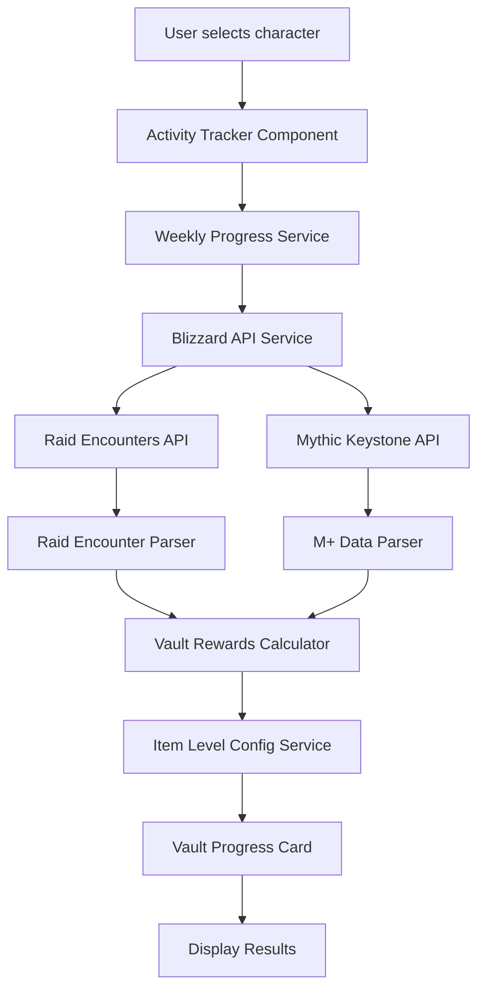

# WoW Character Handler - Complete API Specifications

## Overview
This document provides a comprehensive guide for implementing the Great Vault tracking system in the WoW Character Handler application. It covers everything from Blizzard API authentication through to displaying vault rewards in the UI, including both conceptual explanations and detailed technical specifications.

## Table of Contents
1. [System Overview & Data Flow](#system-overview--data-flow)
2. [Authentication & Configuration](#authentication--configuration)
3. [Blizzard API Integration](#blizzard-api-integration)
4. [Service Architecture](#service-architecture)
5. [Data Models & Interfaces](#data-models--interfaces)~~~~
6. [UI Components](#ui-components)
7. [Vault Calculation Logic](#vault-calculation-logic)
8. [Implementation Examples](#implementation-examples)
9. [Error Handling](#error-handling)
10. [Testing Strategy](#testing-strategy)

## System Overview & Data Flow

### Conceptual Flow
The Great Vault tracking system works by fetching weekly activity data from Blizzard's API, processing it to count completed activities, and then calculating what vault rewards the player would receive. The system follows this high-level flow:

1. **User Input**: Player selects a character from their character list
2. **API Authentication**: System authenticates with Blizzard API using OAuth2
3. **Data Fetching**: Retrieve raid encounters and mythic+ runs for the current week
4. **Data Processing**: Parse and filter data to count relevant activities
5. **Vault Calculation**: Determine vault slots and item levels based on activity counts
6. **UI Display**: Show vault progress with item levels and unlock status

### Technical Data Flow


The system is designed with clear separation of concerns, where each service has a specific responsibility in the data processing pipeline.

## Authentication & Configuration

### Blizzard API Credentials
Users must configure their Blizzard API credentials in the application settings. The credentials are obtained from the Blizzard Developer Portal and include a client ID and secret for OAuth2 authentication.

**Configuration Interface:**
```typescript
interface BlizzardApiConfig {
  clientId: string;
  clientSecret: string;
  region: 'us' | 'eu' | 'kr' | 'tw' | 'cn';
  baseUrl?: string;
}
```

### OAuth2 Authentication Flow
The system uses OAuth2 client credentials flow to authenticate with Blizzard's API. This involves exchanging the client credentials for an access token that's used for subsequent API requests.

**Authentication Request:**
```http
POST https://{region}.battle.net/oauth/token
Content-Type: application/x-www-form-urlencoded

grant_type=client_credentials&client_id={client_id}&client_secret={client_secret}
```

**Token Response:**
```typescript
interface BlizzardTokenResponse {
  access_token: string;
  token_type: 'bearer';
  expires_in: number;
  scope?: string;
}
```

**Authentication Service Methods:**
```typescript
class BlizzardApiService {
  authenticate(): Observable<string>
  refreshToken(): Observable<string>
  isTokenValid(): boolean
  getAuthHeaders(): HttpHeaders
}
```

## Blizzard API Integration

### Core API Endpoints
The system integrates with three main Blizzard API endpoints to gather the necessary data for vault calculations.

#### 1. Character Raid Encounters
This endpoint provides information about raid bosses killed by the character, including difficulty levels and timestamps.

**Endpoint:**
```http
GET https://{region}.api.blizzard.com/profile/wow/character/{realmSlug}/{characterName}/encounters/raids
Authorization: Bearer {access_token}
Namespace: profile-{region}
```

**Service Method:**
```typescript
getCharacterRaidEncounters(
  realmSlug: string,
  characterName: string
): Observable<BlizzardCharacterRaidsResponse>
```

**Purpose:** Retrieves raid boss kills for the current expansion, filtered by "Current Season" to automatically track the active tier without needing manual updates.

#### 2. Character Mythic Keystone Profile
This endpoint provides information about mythic+ dungeons completed by the character, including key levels and completion times.

**Endpoint:**
```http
GET https://{region}.api.blizzard.com/profile/wow/character/{realmSlug}/{characterName}/mythic-keystone-profile
Authorization: Bearer {access_token}
Namespace: profile-{region}
```

**Service Method:**
```typescript
getCharacterMythicKeystoneProfile(
  realmSlug: string,
  characterName: string
): Observable<BlizzardMythicKeystoneResponse>
```

**Purpose:** Retrieves mythic+ runs from the current period, providing key levels needed for vault item level calculations.

#### 3. Realm Information
Used for realm validation and converting realm names to the slug format required by the API.

**Endpoint:**
```http
GET https://{region}.api.blizzard.com/data/wow/realm/{realmSlug}
Authorization: Bearer {access_token}
Namespace: dynamic-{region}
```

**Service Method:**
```typescript
getRealmInfo(realmSlug: string): Observable<BlizzardRealmResponse>
```

## Service Architecture

### 1. BlizzardApiService
The core service responsible for all communication with Blizzard's API. It handles authentication, request formatting, and error handling.

**File:** `src/app/services/blizzard-api.service.ts`

**Key Responsibilities:**
- OAuth2 token management and refresh
- HTTP request configuration with proper headers
- API endpoint abstraction
- Error handling and retry logic
- Realm name formatting

**Complete Service Interface:**
```typescript
@Injectable({ providedIn: 'root' })
export class BlizzardApiService {
  private readonly http = inject(HttpClient);
  private readonly configService = inject(ConfigService);

  // Authentication Methods
  authenticate(): Observable<string>;
  refreshToken(): Observable<string>;
  isTokenValid(): boolean;
  getAuthHeaders(): HttpHeaders;

  // Character Data Methods
  getCharacterRaidEncounters(
    realmSlug: string,
    characterName: string
  ): Observable<BlizzardCharacterRaidsResponse>;

  getCharacterMythicKeystoneProfile(
    realmSlug: string,
    characterName: string
  ): Observable<BlizzardMythicKeystoneResponse>;

  getCharacterProfile(
    realmSlug: string,
    characterName: string
  ): Observable<BlizzardCharacterResponse>;

  // Utility Methods
  formatRealmSlug(realmName: string): string;
  buildApiUrl(endpoint: string, namespace: string): string;
  handleApiError(error: HttpErrorResponse): Observable<never>;
}
```

### 2. WeeklyProgressService
Aggregates data from multiple API endpoints to provide a simple count of weekly activities. This service abstracts the complexity of data processing and provides a clean interface for activity counts.

**File:** `src/app/services/weekly-progress.service.ts`

**Purpose:**
- Fetch and combine raid and mythic+ data
- Filter activities to the current week (Wednesday reset)
- Provide simple counts for vault calculations

**Service Interface:**
```typescript
export interface WeeklyProgress {
  dungeons: number;    // Number of M+ dungeons completed this week
  bosses: number;      // Number of unique raid bosses killed this week
  success: boolean;    // Whether data was successfully retrieved
  error?: string;      // Error message if data retrieval failed
  lastUpdated?: Date;  // When the data was last fetched
  weekStart?: Date;    // Start of the current weekly reset period
}

@Injectable({ providedIn: 'root' })
export class WeeklyProgressService {
  private readonly blizzardApi = inject(BlizzardApiService);
  private readonly raidParser = inject(RaidEncounterParserService);

  // Main Method
  getWeeklyProgress(character: Character): Observable<WeeklyProgress>;

  // Private Helper Methods
  private countWeeklyDungeons(mythicData: BlizzardMythicKeystoneResponse): number;
  private countWeeklyBosses(raidData: BlizzardCharacterRaidsResponse): number;
  private isCurrentWeek(timestamp: number): boolean;
  private getWeekStartDate(): Date;
  private createEmptyProgress(error: string): WeeklyProgress;
}
```

### 3. VaultRewardsCalculatorService
The core calculation engine that transforms weekly activity counts into detailed vault reward information. This service implements the complex logic for determining vault slots, item levels, and reward qualities.

**File:** `src/app/services/vault-rewards-calculator.service.ts`

**Purpose:**
- Calculate vault slots based on activity thresholds
- Determine item levels for each slot
- Map item levels to quality tiers
- Handle detailed M+ key level and raid difficulty analysis

**Key Interfaces:**
```typescript
export interface VaultSlotReward {
  unlocked: boolean;                                    // Whether the slot is unlocked
  quality: 'Mythic' | 'Heroic' | 'Normal' | 'No reward'; // Item quality tier
  itemLevel: number;                                    // Exact item level
  keyLevel?: number;                                    // M+ key level (for M+ slots)
  difficulty?: string;                                  // Raid difficulty (for raid slots)
}

export interface VaultRewards {
  mythicPlus: {
    slots: number;                          // Number of unlocked M+ slots (0-3)
    slot1: VaultSlotReward;                // 1+ dungeons requirement
    slot2: VaultSlotReward;                // 4+ dungeons requirement
    slot3: VaultSlotReward;                // 8+ dungeons requirement
    nextMilestone: { remaining: number };   // Activities needed for next slot
    slotRewards: string[];                 // Quality names for UI display
  };
  raid: {
    slots: number;                          // Number of unlocked raid slots (0-3)
    slot1: VaultSlotReward;                // 2+ bosses requirement
    slot2: VaultSlotReward;                // 4+ bosses requirement
    slot3: VaultSlotReward;                // 6+ bosses requirement
    nextMilestone: { remaining: number };   // Activities needed for next slot
    slotRewards: string[];                 // Quality names for UI display
  };
  success: boolean;                        // Whether calculation succeeded
  error?: string;                          // Error message if calculation failed
}
```

**Complete Service Implementation:**
```typescript
@Injectable({ providedIn: 'root' })
export class VaultRewardsCalculatorService {
  private readonly weeklyProgressService = inject(WeeklyProgressService);
  private readonly blizzardApiService = inject(BlizzardApiService);
  private readonly raidParserService = inject(RaidEncounterParserService);
  private readonly itemLevelConfig = inject(ItemLevelConfigService);

  // Main Calculation Method
  calculateVaultRewards(character: Character): Observable<VaultRewards>;

  // Detailed Calculation Methods
  private getDetailedVaultRewards(
    character: Character,
    progress: WeeklyProgress
  ): Observable<VaultRewards>;

  private calculateMythicPlusRewards(
    dungeonCount: number,
    mythicData: any
  ): VaultMythicPlusRewards;

  private calculateRaidRewards(
    bossCount: number,
    raidData?: any
  ): VaultRaidRewards;

  // Helper Methods
  private extractKeyLevels(mythicData: any): number[];
  private createMythicPlusSlot(unlocked: boolean, keyLevel?: number): VaultSlotReward;
  private createRaidSlot(unlocked: boolean, difficulty: string): VaultSlotReward;
  private calculateSlots(count: number, thresholds: number[]): number;
  private calculateNextMilestone(count: number, thresholds: number[]): { remaining: number };
  private isCurrentWeek(timestamp: number): boolean;
  private createEmptyVaultRewards(error: string): VaultRewards;
}
```

### 4. ItemLevelConfigService
A configuration service that centralizes all item level data for different seasons and content types. This design makes it easy to update item levels when new seasons are released without modifying calculation logic.

**File:** `src/app/services/item-level-config.service.ts`

**Purpose:**
- Centralize item level configuration for maintainability
- Support multiple seasons for historical data
- Provide clean APIs for item level lookups
- Enable easy updates for new content releases

**Configuration Interfaces:**
```typescript
export interface SeasonConfig {
  id: string;                           // Unique season identifier
  name: string;                         // Display name
  mythicPlusLevels: MythicPlusTrack[];  // M+ item level tracks
  raidDifficulties: RaidDifficultyLevel[]; // Raid item levels
  qualityThresholds: QualityThreshold[]; // Quality tier boundaries
}

export interface MythicPlusTrack {
  minKeyLevel: number;                  // Minimum key level for this track
  maxKeyLevel?: number;                 // Maximum key level (optional)
  itemLevel: number;                    // Item level for this track
  trackName: 'Mythic' | 'Hero' | 'Champion' | 'Adventurer'; // Track name
}

export interface RaidDifficultyLevel {
  difficulty: 'Mythic' | 'Heroic' | 'Normal' | 'LFR'; // Raid difficulty
  itemLevel: number;                    // Item level for this difficulty
}

export interface QualityThreshold {
  minItemLevel: number;                 // Minimum item level for this quality
  quality: 'Mythic' | 'Heroic' | 'Normal' | 'No reward'; // Quality tier
}
```

**Service Methods:**
```typescript
@Injectable({ providedIn: 'root' })
export class ItemLevelConfigService {
  // Season Management
  getCurrentSeason(): SeasonConfig;
  getAllSeasons(): SeasonConfig[];
  getSeasonById(seasonId: string): SeasonConfig;

  // Item Level Calculation
  getMythicPlusItemLevel(keyLevel: number, seasonId?: string): number;
  getRaidItemLevel(difficulty: string, seasonId?: string): number;
  getItemQuality(itemLevel: number, seasonId?: string): 'Mythic' | 'Heroic' | 'Normal' | 'No reward';

  // Utility Methods
  getMythicPlusTrackName(keyLevel: number, seasonId?: string): string;
  getMythicPlusTracks(seasonId?: string): MythicPlusTrack[];
  getRaidDifficulties(seasonId?: string): RaidDifficultyLevel[];
}
```

### 5. RaidEncounterParserService
Specialized service for parsing complex Blizzard raid encounter data. This service handles the intricacies of the raid API response format and extracts meaningful information for vault calculations.

**File:** `src/app/features/great-vault/services/raid-encounter-parser.service.ts`

**Purpose:**
- Parse nested Blizzard raid encounter responses
- Extract boss kills with proper difficulty mapping
- Filter encounters to current week for vault eligibility
- Handle "Current Season" expansion filtering

**Data Models:**
```typescript
export interface RaidBossKill {
  bossId: number;           // Blizzard encounter ID
  bossName: string;         // Boss display name
  instanceId: number;       // Raid instance ID
  instanceName: string;     // Raid display name
  difficulty: RaidDifficulty; // Parsed difficulty level
  killedAt: Date;          // Kill timestamp
  lootEligible: boolean;    // Whether kill counts for vault
}

export enum RaidDifficulty {
  LFR = 'lfr',
  Normal = 'normal',
  Heroic = 'heroic',
  Mythic = 'mythic'
}
```

**Service Implementation:**
```typescript
@Injectable({ providedIn: 'root' })
export class RaidEncounterParserService {
  private readonly weeklyResetService = inject(WeeklyResetService);

  // Main Parsing Methods
  parseRaidEncounters(response: BlizzardCharacterRaidsResponse): RaidBossKill[];
  getUniqueBossKills(bossKills: RaidBossKill[]): RaidBossKill[];
  getHighestDifficulty(bossKills: RaidBossKill[]): RaidDifficulty;
  calculateRaidItemLevel(highestDifficulty: RaidDifficulty): number;

  // Helper Methods
  private mapDifficultyFromBlizzard(difficultyType: string): RaidDifficulty;
  private isCurrentWeekKill(timestamp: number): boolean;
  private createBossKill(
    encounter: BlizzardRaidEncounter,
    instance: BlizzardRaidInstance,
    difficulty: RaidDifficulty
  ): RaidBossKill;
}
```

## Data Models & Interfaces

### Core Application Models
These models represent the fundamental data structures used throughout the application.

```typescript
// Main character representation
interface Character {
  id?: string;              // Optional database ID
  name: string;             // Character name
  server: string;           // Realm name
  region: string;           // Region (us, eu, etc.)
  level?: number;           // Character level
  class?: string;           // Character class
  race?: string;            // Character race
  guild?: string;           // Guild name
  lastUpdated?: Date;       // Last data update
}

// Weekly reset timing information
interface WeeklyReset {
  previousWeekStart: Date;  // Previous Wednesday 15:00 UTC
  currentWeekStart: Date;   // Current Wednesday 15:00 UTC
  nextWeekStart: Date;      // Next Wednesday 15:00 UTC
  daysUntilReset: number;   // Days remaining
  hoursUntilReset: number;  // Hours remaining
}
```

### Blizzard API Response Models
These interfaces define the exact structure of responses from Blizzard's API endpoints.

#### Raid Encounters Response
The raid encounters endpoint returns a complex nested structure with expansion, instance, mode, and encounter data.

```typescript
interface BlizzardCharacterRaidsResponse {
  _links?: {
    self: { href: string };
  };
  character: {
    key: { href: string };
    name: string;
    id: number;
    realm: {
      key: { href: string };
      name: string;
      id: number;
      slug: string;
    };
  };
  expansions: Array<{
    expansion: {
      key: { href: string };
      name: string;           // Look for "Current Season"
      id: number;
    };
    instances: BlizzardRaidInstance[];
  }>;
}

interface BlizzardRaidInstance {
  instance: {
    key: { href: string };
    name: string;             // e.g., "Nerub-ar Palace"
    id: number;
  };
  modes: BlizzardRaidMode[];  // Different difficulties
}

interface BlizzardRaidMode {
  difficulty: {
    type: string;             // "MYTHIC", "HEROIC", "NORMAL", "LFR"
    name: string;
  };
  status: {
    type: string;             // "COMPLETE", "IN_PROGRESS", etc.
    name: string;
  };
  progress: {
    completed_count: number;  // Bosses killed in this difficulty
    total_count: number;      // Total bosses in raid
    encounters: BlizzardRaidEncounter[];
  };
}

interface BlizzardRaidEncounter {
  encounter: {
    key: { href: string };
    name: string;             // Boss name
    id: number;
  };
  completed_count: number;    // Number of kills
  last_kill_timestamp: number; // Unix timestamp of last kill
}
```

#### Mythic Keystone Response
The mythic keystone endpoint provides information about completed mythic+ runs.

```typescript
interface BlizzardMythicKeystoneResponse {
  _links?: {
    self: { href: string };
  };
  current_period: {
    period: {
      key: { href: string };
      id: number;             // Current M+ season period
    };
    best_runs: BlizzardMythicKeystoneRun[]; // Best runs this period
  };
  seasons?: Array<{
    id: number;
    best_runs: BlizzardMythicKeystoneRun[];
  }>;
}

interface BlizzardMythicKeystoneRun {
  completed_timestamp: number;        // Unix timestamp of completion
  duration: number;                   // Run duration in milliseconds
  keystone_level: number;             // Key level (2, 5, 10, etc.)
  keystone_affixes: Array<{           // Weekly affixes
    keystone_affix: {
      key: { href: string };
      name: string;
      id: number;
    };
    starting_level: number;
  }>;
  members: Array<{                    // Party members
    character: {
      name: string;
      id: number;
      realm: {
        key: { href: string };
        name: string;
        id: number;
        slug: string;
      };
    };
    specialization: {
      key: { href: string };
      name: string;
      id: number;
    };
    race: {
      key: { href: string };
      name: string;
      id: number;
    };
    equipped_item_level: number;
  }>;
  dungeon: {
    key: { href: string };
    name: string;                     // Dungeon name
    id: number;
  };
  is_completed_within_time: boolean;  // Whether key was timed
  mythic_rating?: {                   // M+ rating info
    color: { r: number; g: number; b: number; a: number };
    rating: number;
  };
  map_rating?: {                      // Dungeon-specific rating
    color: { r: number; g: number; b: number; a: number };
    rating: number;
  };
}
```

## UI Components

### 1. ActivityTrackerComponent
The main container component that displays weekly activity progress and houses the vault progress card.

**File:** `src/app/components/activity-tracker/activity-tracker.component.ts`

**Purpose:**
- Display character weekly activity summary
- Show dungeon and boss counts
- Display weekly reset timer
- Contain the VaultProgressCardComponent
- Handle data refresh functionality

**Component Structure:**
```typescript
@Component({
  selector: 'wow-activity-tracker',
  standalone: true,
  imports: [
    CommonModule,
    FormsModule,
    CardModule,
    PanelModule,
    ProgressBarModule,
    BadgeModule,
    ButtonModule,
    TooltipModule,
    DividerModule,
    TagModule,
    MessageModule,
    CheckboxModule,
    VaultProgressCardComponent
  ],
  templateUrl: './activity-tracker.component.html',
  styleUrl: './activity-tracker.component.scss',
  changeDetection: ChangeDetectionStrategy.OnPush
})
export class ActivityTrackerComponent {
  private readonly weeklyProgressService = inject(WeeklyProgressService);

  // Component Inputs
  readonly selectedCharacter = input<Character | null>(null);

  // State Management
  private readonly weeklyProgress = signal<WeeklyProgress | null>(null);
  protected readonly loading = signal(false);

  // Computed Properties
  protected readonly dungeonCount = computed(() => {
    const progress = this.weeklyProgress();
    return progress?.dungeons ?? 0;
  });

  protected readonly bossCount = computed(() => {
    const progress = this.weeklyProgress();
    return progress?.bosses ?? 0;
  });

  protected readonly isLoaded = computed(() => {
    const progress = this.weeklyProgress();
    return progress?.success ?? false;
  });

  protected readonly errorMessage = computed(() => {
    const progress = this.weeklyProgress();
    return progress?.error ?? null;
  });

  // Weekly Reset Calculations
  protected readonly nextResetDate = computed(() => {
    const now = new Date();
    const nextWednesday = new Date(now);
    nextWednesday.setUTCDate(now.getUTCDate() + ((3 - now.getUTCDay() + 7) % 7));
    nextWednesday.setUTCHours(15, 0, 0, 0); // Wednesday 15:00 UTC

    if (nextWednesday <= now) {
      nextWednesday.setUTCDate(nextWednesday.getUTCDate() + 7);
    }

    return nextWednesday;
  });

  protected readonly timeUntilReset = computed(() => {
    const resetDate = this.nextResetDate();
    const now = new Date();
    const timeDiff = resetDate.getTime() - now.getTime();

    const days = Math.floor(timeDiff / (1000 * 60 * 60 * 24));
    const hours = Math.floor((timeDiff % (1000 * 60 * 60 * 24)) / (1000 * 60 * 60));

    if (days > 0) {
      return `${days}d ${hours}h`;
    }
    return `${hours}h`;
  });

  // Event Handlers
  protected onRefreshData(): void {
    const character = this.selectedCharacter();
    if (character) {
      this.loadWeeklyProgress(character);
    }
  }

  // Data Loading
  private loadWeeklyProgress(character: Character): void {
    this.loading.set(true);

    this.weeklyProgressService.getWeeklyProgress(character).subscribe({
      next: (progress) => {
        this.weeklyProgress.set(progress);
        this.loading.set(false);
      },
      error: (error) => {
        console.error('Error loading weekly progress:', error);
        this.weeklyProgress.set({
          dungeons: 0,
          bosses: 0,
          success: false,
          error: 'Failed to load weekly progress'
        });
        this.loading.set(false);
      }
    });
  }
}
```

### 2. VaultProgressCardComponent
Specialized component for displaying Great Vault rewards and progress.

**File:** `src/app/components/vault-progress-card/vault-progress-card.component.ts`

**Purpose:**
- Accept character input and calculate vault rewards
- Display vault slots with item levels and qualities
- Show progress bars for slot unlock requirements
- Handle loading and error states
- Provide refresh functionality

**Component Implementation:**
```typescript
@Component({
  selector: 'wow-vault-progress-card',
  standalone: true,
  imports: [
    CommonModule,
    CardModule,
    TagModule,
    MessageModule,
    DividerModule,
    ProgressBarModule,
    ButtonModule
  ],
  templateUrl: './vault-progress-card.component.html',
  styleUrl: './vault-progress-card.component.scss',
  changeDetection: ChangeDetectionStrategy.OnPush
})
export class VaultProgressCardComponent {
  private readonly vaultRewardsCalculator = inject(VaultRewardsCalculatorService);

  // Component Inputs
  readonly character = input<Character | null>(null);

  // State Management
  private readonly vaultRewards = signal<VaultRewards | null>(null);
  protected readonly loading = signal(false);

  constructor() {
    // Load vault rewards when character changes
    effect(() => {
      const char = this.character();
      if (char) {
        this.loadVaultRewards(char);
      } else {
        this.vaultRewards.set(null);
      }
    });
  }

  // Computed Properties for Display
  protected readonly mythicPlusVaultProgress = computed(() => {
    const rewards = this.vaultRewards();
    return rewards?.mythicPlus || {
      slots: 0,
      slotRewards: ['No reward', 'No reward', 'No reward'],
      nextMilestone: { remaining: 1 }
    };
  });

  protected readonly raidVaultProgress = computed(() => {
    const rewards = this.vaultRewards();
    return rewards?.raid || {
      slots: 0,
      slotRewards: ['No reward', 'No reward', 'No reward'],
      nextMilestone: { remaining: 2 }
    };
  });

  protected readonly isLoaded = computed(() => {
    const rewards = this.vaultRewards();
    return rewards?.success ?? false;
  });

  protected readonly errorMessage = computed(() => {
    const rewards = this.vaultRewards();
    return rewards?.error ?? null;
  });

  // Event Handlers
  protected onRefreshData(): void {
    const char = this.character();
    if (char) {
      this.loadVaultRewards(char);
    }
  }

  // Helper Methods
  protected getTagSeverity(reward: string): 'success' | 'info' | 'warning' | 'danger' | 'secondary' | 'contrast' {
    switch (reward) {
      case 'Mythic': return 'warning';
      case 'Heroic': return 'info';
      case 'Normal': return 'success';
      case 'LFR': return 'secondary';
      default: return 'secondary';
    }
  }

  protected calculateMythicPlusProgress(): number {
    const progress = this.mythicPlusVaultProgress();
    return Math.round((progress.slots / 3) * 100);
  }

  protected calculateRaidProgress(): number {
    const progress = this.raidVaultProgress();
    return Math.round((progress.slots / 3) * 100);
  }

  // Data Loading
  private loadVaultRewards(character: Character): void {
    this.loading.set(true);

    this.vaultRewardsCalculator.calculateVaultRewards(character).subscribe({
      next: (rewards) => {
        this.vaultRewards.set(rewards);
        this.loading.set(false);
      },
      error: (error) => {
        console.error('Error loading vault rewards:', error);
        this.vaultRewards.set({
          mythicPlus: {
            slots: 0,
            slot1: { unlocked: false, quality: 'No reward', itemLevel: 0 },
            slot2: { unlocked: false, quality: 'No reward', itemLevel: 0 },
            slot3: { unlocked: false, quality: 'No reward', itemLevel: 0 },
            nextMilestone: { remaining: 1 },
            slotRewards: ['No reward', 'No reward', 'No reward']
          },
          raid: {
            slots: 0,
            slot1: { unlocked: false, quality: 'No reward', itemLevel: 0 },
            slot2: { unlocked: false, quality: 'No reward', itemLevel: 0 },
            slot3: { unlocked: false, quality: 'No reward', itemLevel: 0 },
            nextMilestone: { remaining: 2 },
            slotRewards: ['No reward', 'No reward', 'No reward']
          },
          success: false,
          error: 'Failed to load vault rewards'
        });
        this.loading.set(false);
      }
    });
  }
}
```

## Vault Calculation Logic

### Understanding the Great Vault System
World of Warcraft's Great Vault is a weekly reward system that provides players with high-level gear based on their activities. The vault has two main categories:

1. **Mythic+ Vault**: Rewards based on mythic+ dungeons completed
2. **Raid Vault**: Rewards based on raid bosses defeated

Each category can unlock up to 3 slots, with each slot requiring progressively more activity.

### Mythic+ Vault Rules
The mythic+ vault follows these unlock requirements:
- **Slot 1**: Complete 1+ mythic+ dungeons (key level 2 or higher)
- **Slot 2**: Complete 4+ mythic+ dungeons (key level 2 or higher)
- **Slot 3**: Complete 8+ mythic+ dungeons (key level 2 or higher)

**Item Level Calculation**: The item level of each slot is determined by the Nth highest key completed, where N corresponds to the slot requirement:
- Slot 1 uses the 1st highest key level
- Slot 2 uses the 4th highest key level
- Slot 3 uses the 8th highest key level

### Raid Vault Rules
The raid vault follows these unlock requirements:
- **Slot 1**: Defeat 2+ unique raid bosses
- **Slot 2**: Defeat 4+ unique raid bosses
- **Slot 3**: Defeat 6+ unique raid bosses

**Item Level Calculation**: The item level of each slot is determined by the Nth highest difficulty kill:
- Slot 1 uses the 2nd highest difficulty kill
- Slot 2 uses the 4th highest difficulty kill
- Slot 3 uses the 6th highest difficulty kill

### Current Season Item Levels (TWW Season 1)
The ItemLevelConfigService manages these values for easy seasonal updates:

**Mythic+ Item Levels by Key Level:**
- Key levels 2-3: 694 item level (Champion track)
- Key levels 4-5: 697 item level (Hero track)
- Key level 6: 701 item level (Hero track)
- Key levels 7-9: 704 item level (Hero track)
- Key levels 10+: 707 item level (Mythic track)

**Raid Item Levels by Difficulty:**
- LFR: 450 item level
- Normal: 680 item level
- Heroic: 701 item level
- Mythic: 707 item level

**Quality Thresholds:**
- 707+ item level: Mythic quality
- 694+ item level: Heroic quality
- 680+ item level: Normal quality
- Below 680: No reward quality

### Weekly Reset Logic
The Great Vault operates on a weekly reset cycle:
- **Reset Time**: Every Wednesday at 15:00 UTC
- **Data Filtering**: Only activities completed after the most recent Wednesday 15:00 UTC count toward the current week's vault
- **Timestamp Handling**: Blizzard API provides Unix timestamps that must be converted and compared against the reset time

**Reset Calculation Implementation:**
```typescript
private isCurrentWeek(timestamp: number): boolean {
  const now = new Date();
  const runDate = new Date(timestamp);

  // Get current Wednesday 15:00 UTC
  const currentWeek = new Date(now);
  currentWeek.setUTCDate(now.getUTCDate() - ((now.getUTCDay() + 4) % 7));
  currentWeek.setUTCHours(15, 0, 0, 0);

  if (currentWeek > now) {
    currentWeek.setUTCDate(currentWeek.getUTCDate() - 7);
  }

  return runDate >= currentWeek;
}
```

## Implementation Examples

### 1. Complete Vault Calculation Flow
This example shows how the entire vault calculation process works from user input to UI display:

```typescript
// User selects character in ActivityTrackerComponent
export class ActivityTrackerComponent {
  constructor() {
    effect(() => {
      const character = this.selectedCharacter();
      if (character) {
        this.loadWeeklyProgress(character);
      }
    });
  }

  private loadWeeklyProgress(character: Character): void {
    this.loading.set(true);

    // Step 1: Get weekly activity counts
    this.weeklyProgressService.getWeeklyProgress(character).subscribe({
      next: (progress) => {
        this.weeklyProgress.set(progress);
        this.loading.set(false);

        // This triggers the VaultProgressCardComponent to calculate rewards
      },
      error: (error) => {
        this.handleError(error);
      }
    });
  }
}

// VaultProgressCardComponent calculates detailed rewards
export class VaultProgressCardComponent {
  constructor() {
    effect(() => {
      const char = this.character();
      if (char) {
        // Step 2: Calculate detailed vault rewards
        this.loadVaultRewards(char);
      }
    });
  }

  private loadVaultRewards(character: Character): void {
    this.loading.set(true);

    this.vaultRewardsCalculator.calculateVaultRewards(character).subscribe({
      next: (rewards) => {
        // Step 3: Display calculated rewards in UI
        this.vaultRewards.set(rewards);
        this.loading.set(false);
      },
      error: (error) => {
        this.handleError(error);
      }
    });
  }
}
```

### 2. Weekly Progress Calculation
This example demonstrates how the WeeklyProgressService aggregates data from multiple API endpoints:

```typescript
export class WeeklyProgressService {
  getWeeklyProgress(character: Character): Observable<WeeklyProgress> {
    const realmSlug = this.formatRealmSlug(character.server);

    // Step 1: Fetch data from both API endpoints in parallel
    return forkJoin({
      raidData: this.blizzardApi.getCharacterRaidEncounters(realmSlug, character.name)
        .pipe(catchError(() => of(null))),
      mythicData: this.blizzardApi.getCharacterMythicKeystoneProfile(realmSlug, character.name)
        .pipe(catchError(() => of(null)))
    }).pipe(
      map(({ raidData, mythicData }) => {
        // Step 2: Process and count activities
        const dungeons = mythicData ? this.countWeeklyDungeons(mythicData) : 0;
        const bosses = raidData ? this.countWeeklyBosses(raidData) : 0;

        return {
          dungeons,
          bosses,
          success: true,
          lastUpdated: new Date(),
          weekStart: this.getWeekStartDate()
        };
      }),
      catchError(error => of(this.createEmptyProgress(error.message || 'Unknown error')))
    );
  }

  private countWeeklyDungeons(mythicData: BlizzardMythicKeystoneResponse): number {
    if (!mythicData?.current_period?.best_runs) {
      return 0;
    }

    // Filter runs to current week and count unique dungeons
    const currentWeekRuns = mythicData.current_period.best_runs
      .filter(run => this.isCurrentWeek(run.completed_timestamp))
      .filter(run => run.keystone_level >= 2); // Must be key level 2+

    return currentWeekRuns.length;
  }

  private countWeeklyBosses(raidData: BlizzardCharacterRaidsResponse): number {
    // Parse raid data and count unique boss kills this week
    const bossKills = this.raidParser.parseRaidEncounters(raidData);
    const currentWeekKills = bossKills.filter(kill =>
      this.isCurrentWeek(kill.killedAt.getTime())
    );

    // Count unique bosses (same boss on different difficulties = 1 boss)
    const uniqueBosses = this.raidParser.getUniqueBossKills(currentWeekKills);
    return uniqueBosses.length;
  }
}
```

### 3. Detailed Vault Reward Calculation
This example shows how the VaultRewardsCalculatorService determines specific item levels and qualities:

```typescript
export class VaultRewardsCalculatorService {
  calculateVaultRewards(character: Character): Observable<VaultRewards> {
    return this.weeklyProgressService.getWeeklyProgress(character).pipe(
      switchMap(progress => {
        if (!progress.success) {
          return of(this.createEmptyVaultRewards(progress.error || 'Failed to load weekly progress'));
        }

        // Get detailed API data for item level calculations
        return this.getDetailedVaultRewards(character, progress);
      }),
      catchError(error => of(this.createEmptyVaultRewards(error.message || 'Unknown error')))
    );
  }

  private getDetailedVaultRewards(character: Character, progress: WeeklyProgress): Observable<VaultRewards> {
    const realmSlug = this.formatRealmSlug(character.server);

    // Fetch detailed data for item level calculations
    const mythicKeystone$ = this.blizzardApiService.getCharacterMythicKeystoneProfile(realmSlug, character.name)
      .pipe(catchError(() => of(null)));

    const raidEncounters$ = this.blizzardApiService.getCharacterRaidEncounters(realmSlug, character.name)
      .pipe(catchError(() => of(null)));

    return mythicKeystone$.pipe(
      switchMap(mythicData => {
        return raidEncounters$.pipe(
          map(raidData => {
            // Calculate detailed rewards with item levels
            const mythicPlusRewards = this.calculateMythicPlusRewards(progress.dungeons, mythicData);
            const raidRewards = this.calculateRaidRewards(progress.bosses, raidData);

            return {
              mythicPlus: mythicPlusRewards,
              raid: raidRewards,
              success: true
            };
          })
        );
      })
    );
  }

  private calculateMythicPlusRewards(dungeonCount: number, mythicData: any) {
    const slots = this.calculateSlots(dungeonCount, [1, 4, 8]);

    // Extract key levels from API data
    const keyLevels = this.extractKeyLevels(mythicData);

    // Calculate rewards for each slot using Nth highest key
    const slot1 = this.createMythicPlusSlot(dungeonCount >= 1, keyLevels[0]);  // 1st highest
    const slot2 = this.createMythicPlusSlot(dungeonCount >= 4, keyLevels[3]);  // 4th highest
    const slot3 = this.createMythicPlusSlot(dungeonCount >= 8, keyLevels[7]);  // 8th highest

    const nextMilestone = this.calculateNextMilestone(dungeonCount, [1, 4, 8]);
    const slotRewards = [slot1.quality, slot2.quality, slot3.quality];

    return {
      slots,
      slot1,
      slot2,
      slot3,
      nextMilestone,
      slotRewards
    };
  }

  private createMythicPlusSlot(unlocked: boolean, keyLevel?: number): VaultSlotReward {
    if (!unlocked || !keyLevel) {
      return {
        unlocked: false,
        quality: 'No reward',
        itemLevel: 0
      };
    }

    // Use ItemLevelConfigService for item level calculation
    const itemLevel = this.itemLevelConfig.getMythicPlusItemLevel(keyLevel);
    const quality = this.itemLevelConfig.getItemQuality(itemLevel);

    return {
      unlocked: true,
      quality,
      itemLevel,
      keyLevel
    };
  }
}
```

### 4. Item Level Configuration Example
This shows how the ItemLevelConfigService manages seasonal data:

```typescript
export class ItemLevelConfigService {
  private readonly TWW_SEASON_1: SeasonConfig = {
    id: 'tww-s1',
    name: 'The War Within Season 1',
    mythicPlusLevels: [
      { minKeyLevel: 10, itemLevel: 707, trackName: 'Mythic' },
      { minKeyLevel: 7, maxKeyLevel: 9, itemLevel: 704, trackName: 'Hero' },
      { minKeyLevel: 6, maxKeyLevel: 6, itemLevel: 701, trackName: 'Hero' },
      { minKeyLevel: 4, maxKeyLevel: 5, itemLevel: 697, trackName: 'Hero' },
      { minKeyLevel: 2, maxKeyLevel: 3, itemLevel: 694, trackName: 'Champion' },
      { minKeyLevel: 0, maxKeyLevel: 1, itemLevel: 450, trackName: 'Adventurer' }
    ],
    raidDifficulties: [
      { difficulty: 'Mythic', itemLevel: 707 },
      { difficulty: 'Heroic', itemLevel: 701 },
      { difficulty: 'Normal', itemLevel: 680 },
      { difficulty: 'LFR', itemLevel: 450 }
    ],
    qualityThresholds: [
      { minItemLevel: 707, quality: 'Mythic' },
      { minItemLevel: 694, quality: 'Heroic' },
      { minItemLevel: 680, quality: 'Normal' },
      { minItemLevel: 0, quality: 'No reward' }
    ]
  };

  getMythicPlusItemLevel(keyLevel: number, seasonId?: string): number {
    const season = seasonId ? this.getSeasonById(seasonId) : this.getCurrentSeason();

    const track = season.mythicPlusLevels.find(level =>
      keyLevel >= level.minKeyLevel &&
      (level.maxKeyLevel === undefined || keyLevel <= level.maxKeyLevel)
    );

    return track?.itemLevel ?? 450;
  }

  getItemQuality(itemLevel: number, seasonId?: string): 'Mythic' | 'Heroic' | 'Normal' | 'No reward' {
    const season = seasonId ? this.getSeasonById(seasonId) : this.getCurrentSeason();

    // Sort thresholds in descending order to check highest first
    const sortedThresholds = [...season.qualityThresholds].sort(
      (a, b) => b.minItemLevel - a.minItemLevel
    );

    for (const threshold of sortedThresholds) {
      if (itemLevel >= threshold.minItemLevel) {
        return threshold.quality;
      }
    }

    return 'No reward';
  }
}
```

## Error Handling

### Understanding Common Errors
The system needs to handle various types of errors that can occur during API communication and data processing.

### Error Classification
```typescript
enum BlizzardApiErrorType {
  AUTHENTICATION_FAILED = 'AUTHENTICATION_FAILED',    // Invalid credentials
  CHARACTER_NOT_FOUND = 'CHARACTER_NOT_FOUND',        // Invalid character/realm
  REALM_NOT_FOUND = 'REALM_NOT_FOUND',                // Invalid realm name
  RATE_LIMITED = 'RATE_LIMITED',                      // Too many requests
  NETWORK_ERROR = 'NETWORK_ERROR',                    // Connection issues
  INVALID_RESPONSE = 'INVALID_RESPONSE',              // Malformed API response
  INSUFFICIENT_PERMISSIONS = 'INSUFFICIENT_PERMISSIONS' // Missing API scopes
}

interface BlizzardApiError {
  type: BlizzardApiErrorType;
  message: string;           // User-friendly error message
  details?: any;             // Technical error details
  retryable: boolean;        // Whether the request can be retried
  retryAfter?: number;       // Seconds to wait before retry
}
```

### Error Handling Implementation
```typescript
export class BlizzardApiService {
  handleApiError(error: HttpErrorResponse): Observable<never> {
    let apiError: BlizzardApiError;

    switch (error.status) {
      case 401:
        apiError = {
          type: BlizzardApiErrorType.AUTHENTICATION_FAILED,
          message: 'Invalid or expired API credentials. Please check your settings.',
          retryable: true
        };
        // Attempt to refresh token
        this.refreshToken();
        break;

      case 404:
        if (error.url?.includes('/character/')) {
          apiError = {
            type: BlizzardApiErrorType.CHARACTER_NOT_FOUND,
            message: 'Character not found. Check character name and realm.',
            retryable: false
          };
        } else {
          apiError = {
            type: BlizzardApiErrorType.REALM_NOT_FOUND,
            message: 'Realm not found. Check realm name.',
            retryable: false
          };
        }
        break;

      case 429:
        const retryAfter = parseInt(error.headers.get('Retry-After') || '60');
        apiError = {
          type: BlizzardApiErrorType.RATE_LIMITED,
          message: `Rate limit exceeded. Please wait ${retryAfter} seconds.`,
          retryable: true,
          retryAfter
        };
        break;

      case 403:
        apiError = {
          type: BlizzardApiErrorType.INSUFFICIENT_PERMISSIONS,
          message: 'Insufficient API permissions. Check your API key configuration.',
          retryable: false
        };
        break;

      default:
        apiError = {
          type: BlizzardApiErrorType.NETWORK_ERROR,
          message: 'Network or server error. Please try again.',
          retryable: true,
          details: error.message
        };
    }

    console.error(`Blizzard API Error [${apiError.type}]:`, apiError.message, apiError.details);
    return throwError(() => apiError);
  }
}
```

### User-Friendly Error Display
The UI components should translate technical errors into actionable user guidance:

```typescript
export class VaultProgressCardComponent {
  protected getErrorMessage(error: string): string {
    if (error.includes('CHARACTER_NOT_FOUND')) {
      return 'Character not found. Please verify the character name and realm are correct.';
    }

    if (error.includes('AUTHENTICATION_FAILED')) {
      return 'API authentication failed. Please check your Blizzard API credentials in Settings.';
    }

    if (error.includes('RATE_LIMITED')) {
      return 'Too many requests. Please wait a moment before refreshing.';
    }

    return 'Unable to load vault data. Please try refreshing or check your internet connection.';
  }

  protected getErrorSeverity(error: string): 'error' | 'warn' | 'info' {
    if (error.includes('CHARACTER_NOT_FOUND') || error.includes('AUTHENTICATION_FAILED')) {
      return 'error';
    }

    if (error.includes('RATE_LIMITED')) {
      return 'warn';
    }

    return 'info';
  }
}
```

### Retry Logic
For retryable errors, implement exponential backoff:

```typescript
export class BlizzardApiService {
  private retryWithBackoff<T>(operation: () => Observable<T>, maxRetries: number = 3): Observable<T> {
    return operation().pipe(
      retryWhen(errors =>
        errors.pipe(
          scan((retryCount, error) => {
            if (retryCount >= maxRetries || !this.isRetryableError(error)) {
              throw error;
            }
            return retryCount + 1;
          }, 0),
          delay((retryCount) => Math.pow(2, retryCount) * 1000) // Exponential backoff
        )
      )
    );
  }

  private isRetryableError(error: any): boolean {
    return error.retryable === true;
  }
}
```

## Testing Strategy

### Unit Testing Approach
The testing strategy focuses on isolated testing of each service and component with mocked dependencies.

### Service Testing Examples
```typescript
describe('VaultRewardsCalculatorService', () => {
  let service: VaultRewardsCalculatorService;
  let mockWeeklyProgressService: jasmine.SpyObj<WeeklyProgressService>;
  let mockItemLevelConfig: jasmine.SpyObj<ItemLevelConfigService>;
  let mockBlizzardApi: jasmine.SpyObj<BlizzardApiService>;
  let mockRaidParser: jasmine.SpyObj<RaidEncounterParserService>;

  beforeEach(() => {
    const weeklyProgressSpy = jasmine.createSpyObj('WeeklyProgressService', ['getWeeklyProgress']);
    const itemLevelSpy = jasmine.createSpyObj('ItemLevelConfigService', [
      'getMythicPlusItemLevel',
      'getRaidItemLevel',
      'getItemQuality'
    ]);
    const blizzardApiSpy = jasmine.createSpyObj('BlizzardApiService', [
      'getCharacterMythicKeystoneProfile',
      'getCharacterRaidEncounters'
    ]);
    const raidParserSpy = jasmine.createSpyObj('RaidEncounterParserService', [
      'parseRaidEncounters',
      'getUniqueBossKills'
    ]);

    TestBed.configureTestingModule({
      providers: [
        VaultRewardsCalculatorService,
        { provide: WeeklyProgressService, useValue: weeklyProgressSpy },
        { provide: ItemLevelConfigService, useValue: itemLevelSpy },
        { provide: BlizzardApiService, useValue: blizzardApiSpy },
        { provide: RaidEncounterParserService, useValue: raidParserSpy }
      ]
    });

    service = TestBed.inject(VaultRewardsCalculatorService);
    mockWeeklyProgressService = TestBed.inject(WeeklyProgressService) as jasmine.SpyObj<WeeklyProgressService>;
    mockItemLevelConfig = TestBed.inject(ItemLevelConfigService) as jasmine.SpyObj<ItemLevelConfigService>;
    mockBlizzardApi = TestBed.inject(BlizzardApiService) as jasmine.SpyObj<BlizzardApiService>;
    mockRaidParser = TestBed.inject(RaidEncounterParserService) as jasmine.SpyObj<RaidEncounterParserService>;
  });

  describe('calculateVaultRewards', () => {
    it('should calculate mythic+ vault rewards correctly for full progress', fakeAsync(() => {
      // Arrange
      const mockCharacter: Character = {
        name: 'TestChar',
        server: 'Stormrage',
        region: 'us'
      };

      const mockProgress: WeeklyProgress = {
        dungeons: 8,
        bosses: 6,
        success: true
      };

      const mockMythicData = {
        current_period: {
          best_runs: [
            { completed_timestamp: Date.now(), keystone_level: 12 },
            { completed_timestamp: Date.now(), keystone_level: 10 },
            { completed_timestamp: Date.now(), keystone_level: 8 },
            { completed_timestamp: Date.now(), keystone_level: 7 },
            { completed_timestamp: Date.now(), keystone_level: 6 },
            { completed_timestamp: Date.now(), keystone_level: 5 },
            { completed_timestamp: Date.now(), keystone_level: 4 },
            { completed_timestamp: Date.now(), keystone_level: 3 }
          ]
        }
      };

      // Setup mocks
      mockWeeklyProgressService.getWeeklyProgress.and.returnValue(of(mockProgress));
      mockBlizzardApi.getCharacterMythicKeystoneProfile.and.returnValue(of(mockMythicData));
      mockBlizzardApi.getCharacterRaidEncounters.and.returnValue(of(null));

      mockItemLevelConfig.getMythicPlusItemLevel.and.returnValues(707, 704, 697); // Key levels 12, 7, 4
      mockItemLevelConfig.getItemQuality.and.returnValues('Mythic', 'Heroic', 'Heroic');

      // Act
      let result: VaultRewards | undefined;
      service.calculateVaultRewards(mockCharacter).subscribe(rewards => {
        result = rewards;
      });
      tick();

      // Assert
      expect(result).toBeDefined();
      expect(result!.success).toBe(true);
      expect(result!.mythicPlus.slots).toBe(3);
      expect(result!.mythicPlus.slot1.unlocked).toBe(true);
      expect(result!.mythicPlus.slot1.quality).toBe('Mythic');
      expect(result!.mythicPlus.slot1.itemLevel).toBe(707);
      expect(result!.mythicPlus.slot1.keyLevel).toBe(12);

      expect(result!.mythicPlus.slot2.unlocked).toBe(true);
      expect(result!.mythicPlus.slot2.quality).toBe('Heroic');
      expect(result!.mythicPlus.slot2.itemLevel).toBe(704);
      expect(result!.mythicPlus.slot2.keyLevel).toBe(7);

      expect(result!.mythicPlus.slot3.unlocked).toBe(true);
      expect(result!.mythicPlus.slot3.quality).toBe('Heroic');
      expect(result!.mythicPlus.slot3.itemLevel).toBe(697);
      expect(result!.mythicPlus.slot3.keyLevel).toBe(4);
    }));

    it('should handle partial progress correctly', fakeAsync(() => {
      // Test case for partial progress (4 dungeons, 2 bosses)
      const mockProgress: WeeklyProgress = {
        dungeons: 4,
        bosses: 2,
        success: true
      };

      mockWeeklyProgressService.getWeeklyProgress.and.returnValue(of(mockProgress));
      // ... setup other mocks

      let result: VaultRewards | undefined;
      service.calculateVaultRewards(mockCharacter).subscribe(rewards => {
        result = rewards;
      });
      tick();

      expect(result!.mythicPlus.slots).toBe(2); // 4 dungeons = 2 slots
      expect(result!.raid.slots).toBe(1);       // 2 bosses = 1 slot
      expect(result!.mythicPlus.nextMilestone.remaining).toBe(4); // Need 4 more for slot 3
      expect(result!.raid.nextMilestone.remaining).toBe(2);       // Need 2 more for slot 2
    }));

    it('should handle API errors gracefully', fakeAsync(() => {
      mockWeeklyProgressService.getWeeklyProgress.and.returnValue(
        throwError(() => new Error('API Error'))
      );

      let result: VaultRewards | undefined;
      service.calculateVaultRewards(mockCharacter).subscribe(rewards => {
        result = rewards;
      });
      tick();

      expect(result!.success).toBe(false);
      expect(result!.error).toContain('API Error');
      expect(result!.mythicPlus.slots).toBe(0);
      expect(result!.raid.slots).toBe(0);
    }));
  });
});
```

### Integration Testing with Mock Data
```typescript
describe('End-to-End Vault Calculation Integration', () => {
  let fixture: ComponentFixture<VaultProgressCardComponent>;
  let component: VaultProgressCardComponent;

  // Mock Blizzard API responses
  const MOCK_RAID_RESPONSE: BlizzardCharacterRaidsResponse = {
    character: {
      key: { href: "https://us.api.blizzard.com/profile/wow/character/stormrage/testchar" },
      name: "TestChar",
      id: 123456789,
      realm: {
        key: { href: "https://us.api.blizzard.com/data/wow/realm/stormrage" },
        name: "Stormrage",
        id: 60,
        slug: "stormrage"
      }
    },
    expansions: [
      {
        expansion: {
          key: { href: "https://us.api.blizzard.com/data/wow/expansion/505" },
          name: "Current Season",
          id: 505
        },
        instances: [
          {
            instance: {
              key: { href: "https://us.api.blizzard.com/data/wow/instance/1273" },
              name: "Nerub-ar Palace",
              id: 1273
            },
            modes: [
              {
                difficulty: { type: "MYTHIC", name: "Mythic" },
                status: { type: "COMPLETE", name: "Complete" },
                progress: {
                  completed_count: 8,
                  total_count: 8,
                  encounters: [
                    {
                      encounter: {
                        key: { href: "https://us.api.blizzard.com/data/wow/encounter/2902" },
                        name: "Ulgrax the Devourer",
                        id: 2902
                      },
                      completed_count: 1,
                      last_kill_timestamp: Date.now() - 86400000 // 1 day ago
                    },
                    // ... more boss encounters
                  ]
                }
              }
            ]
          }
        ]
      }
    ]
  };

  const MOCK_MYTHIC_RESPONSE: BlizzardMythicKeystoneResponse = {
    current_period: {
      period: {
        key: { href: "https://us.api.blizzard.com/data/wow/mythic-keystone/period/754" },
        id: 754
      },
      best_runs: [
        {
          completed_timestamp: Date.now() - 86400000,
          duration: 1234567,
          keystone_level: 10,
          keystone_affixes: [],
          members: [],
          dungeon: {
            key: { href: "https://us.api.blizzard.com/data/wow/mythic-keystone/dungeon/375" },
            name: "Mists of Tirna Scithe",
            id: 375
          },
          is_completed_within_time: true
        },
        // ... more dungeon runs
      ]
    }
  };

  beforeEach(() => {
    // Setup TestBed with real services and mock HTTP client
    TestBed.configureTestingModule({
      imports: [VaultProgressCardComponent],
      providers: [
        // Use real services
        VaultRewardsCalculatorService,
        WeeklyProgressService,
        ItemLevelConfigService,
        RaidEncounterParserService,
        // Mock HTTP client for API calls
        {
          provide: HttpClient,
          useValue: jasmine.createSpyObj('HttpClient', ['get', 'post'])
        }
      ]
    });

    fixture = TestBed.createComponent(VaultProgressCardComponent);
    component = fixture.componentInstance;
  });

  it('should display vault rewards for character with full progress', fakeAsync(() => {
    // Setup HTTP client mocks to return test data
    const mockHttp = TestBed.inject(HttpClient) as jasmine.SpyObj<HttpClient>;
    mockHttp.get.and.returnValues(
      of(MOCK_RAID_RESPONSE),
      of(MOCK_MYTHIC_RESPONSE)
    );

    // Set character input
    const testCharacter: Character = {
      name: 'TestChar',
      server: 'Stormrage',
      region: 'us'
    };
    component.character = signal(testCharacter);

    // Trigger change detection
    fixture.detectChanges();
    tick();

    // Verify UI displays correct vault information
    const vaultRewards = component.vaultRewards();
    expect(vaultRewards?.success).toBe(true);
    expect(vaultRewards?.mythicPlus.slots).toBeGreaterThan(0);
    expect(vaultRewards?.raid.slots).toBeGreaterThan(0);

    // Check that UI elements are rendered
    const compiled = fixture.nativeElement;
    expect(compiled.querySelector('.vault-progress-bar')).toBeTruthy();
    expect(compiled.querySelector('.vault-rewards-row')).toBeTruthy();
  }));
});
```

### Test Data Scenarios
```typescript
// Comprehensive test scenarios for different character states
const TEST_SCENARIOS = {
  noActivity: {
    description: 'Character with no weekly activity',
    weeklyProgress: { dungeons: 0, bosses: 0, success: true },
    expectedMythicSlots: 0,
    expectedRaidSlots: 0,
    expectedNextMilestones: { mythicPlus: 1, raid: 2 }
  },

  partialMythicPlus: {
    description: 'Character with partial M+ progress',
    weeklyProgress: { dungeons: 4, bosses: 0, success: true },
    expectedMythicSlots: 2,
    expectedRaidSlots: 0,
    expectedNextMilestones: { mythicPlus: 4, raid: 2 }
  },

  fullProgress: {
    description: 'Character with maximum progress',
    weeklyProgress: { dungeons: 10, bosses: 8, success: true },
    expectedMythicSlots: 3,
    expectedRaidSlots: 3,
    expectedNextMilestones: { mythicPlus: 0, raid: 0 }
  },

  mixedDifficulties: {
    description: 'Character with mixed raid difficulties',
    raidKills: [
      { bossId: 1, difficulty: RaidDifficulty.Normal, killedAt: new Date() },
      { bossId: 2, difficulty: RaidDifficulty.Heroic, killedAt: new Date() },
      { bossId: 3, difficulty: RaidDifficulty.Mythic, killedAt: new Date() },
      { bossId: 4, difficulty: RaidDifficulty.Heroic, killedAt: new Date() }
    ],
    expectedHighestDifficulty: RaidDifficulty.Mythic,
    expectedSlot1Quality: 'Heroic', // 2nd highest = Heroic
    expectedSlot2Quality: 'Heroic'  // 4th highest = Heroic
  },

  highKeyLevels: {
    description: 'Character with high M+ keys',
    keyLevels: [15, 12, 10, 9, 8, 7, 6, 5],
    expectedSlot1ItemLevel: 707, // Key 15 = 707
    expectedSlot2ItemLevel: 704, // Key 9 = 704
    expectedSlot3ItemLevel: 701  // Key 6 = 701
  },

  apiErrors: {
    description: 'Various API error scenarios',
    errors: [
      { type: 'CHARACTER_NOT_FOUND', expectedMessage: 'Character not found' },
      { type: 'AUTHENTICATION_FAILED', expectedMessage: 'API authentication failed' },
      { type: 'RATE_LIMITED', expectedMessage: 'Too many requests' },
      { type: 'NETWORK_ERROR', expectedMessage: 'Network or server error' }
    ]
  }
};

// Use these scenarios in parameterized tests
TEST_SCENARIOS.forEach(scenario => {
  it(`should handle ${scenario.description}`, () => {
    // Test implementation using scenario data
  });
});
```

This comprehensive specification provides both the conceptual understanding and technical implementation details needed to build a complete Great Vault tracking system, from initial API authentication through to displaying rewards in the user interface.
